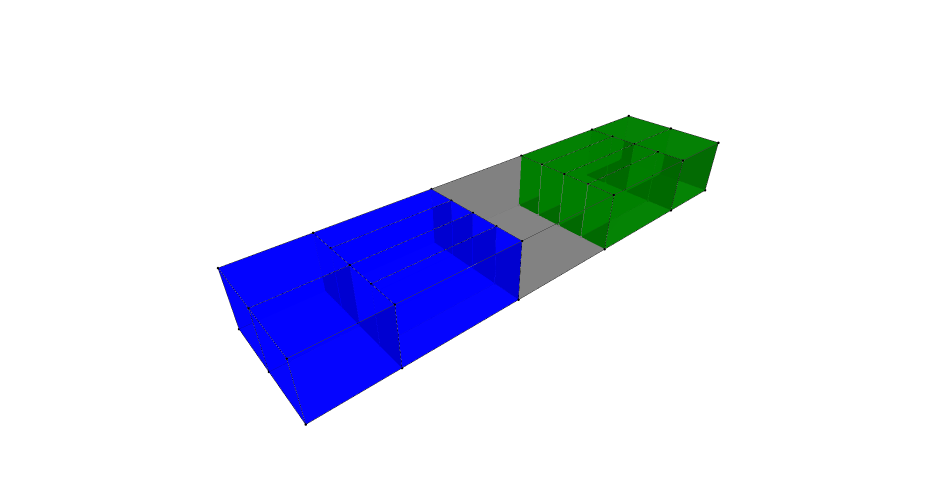
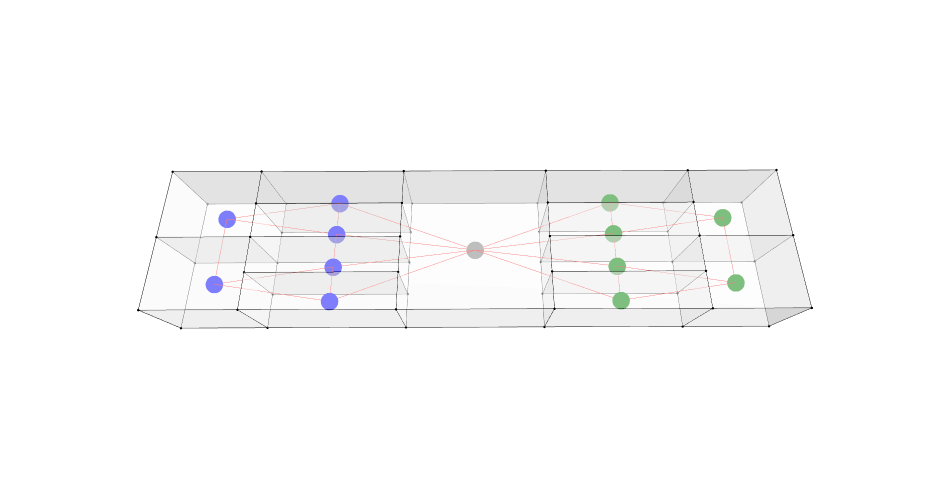
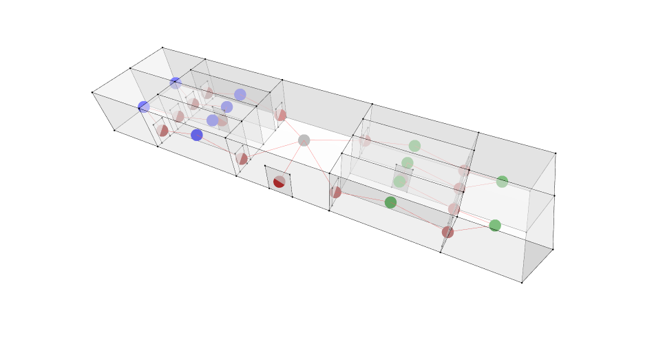

# Assignment 01: A Study of a Museum - Spatial Relationships and Pathway Analysis

This directory contains `Assignment_01_Giovanni-Carlo-Volpe.ipynb`, a Jupyter Notebook focused on generating and analyzing a graph representation of an architectural museum model. The aim of this study is to understand spatial relationships and how individuals might navigate the pathways inside the museum.

## Overview

The purpose of this notebook is to convert an architectural 3D model into an interconnected adjacency graph using [TopologicPy](https://topologic.app/). We study how the rooms, corridors, and primary spaces connect to understand accessibility and layout efficiency. 

## Workflow

The notebook follows these key steps:

1. **Load Building Model:** It loads an OBJ file containing the volumetric properties of the museum's rooms.
2. **Classify Rooms:** Rooms are categorized based on their names (e.g., Wing A, Wing B, Lobby) and assigned different colors and sizes to distinguish them.
3. **Assemble the Museum Complex:** Volumetric cells (rooms) are merged into a single CellComplex model sharing connecting faces.
4. **Generate Graphical Representation:** A mathematical graph is extracted where nodes represent the rooms and edges represent their shared topological adjacencies (faces).
5. **Visualization:** The 3D architectural geometry and the resulting network graph are displayed to showcase spatial connections.

## Visualizations

### 1. The Museum Model
This is the 3D visualization of the museum structure, where rooms are mapped and color-coded.

### 2. Graph Adjacency
Below is the network representation of the museum paths and spatial adjacency logic.

### 3. Final Topology

## Requirements
- Python environment with TopologicPy (0.9.18 or newer).
- Jupyter Notebook compatible environment like VS Code or browser.
