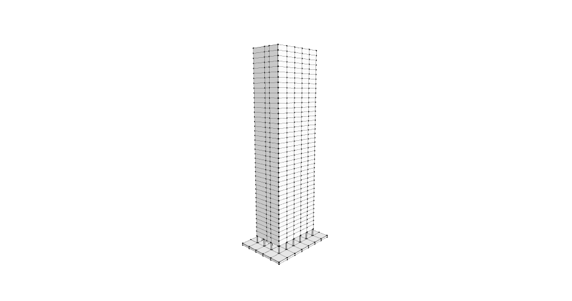
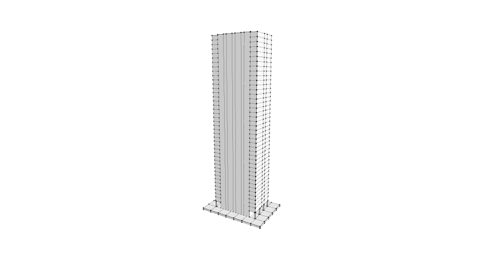
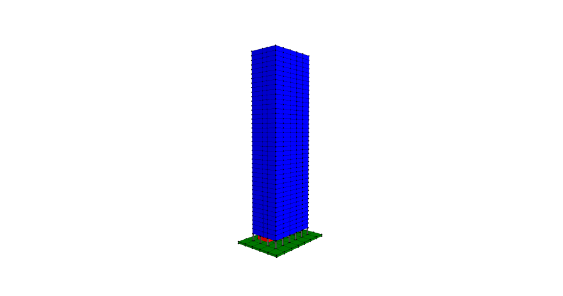
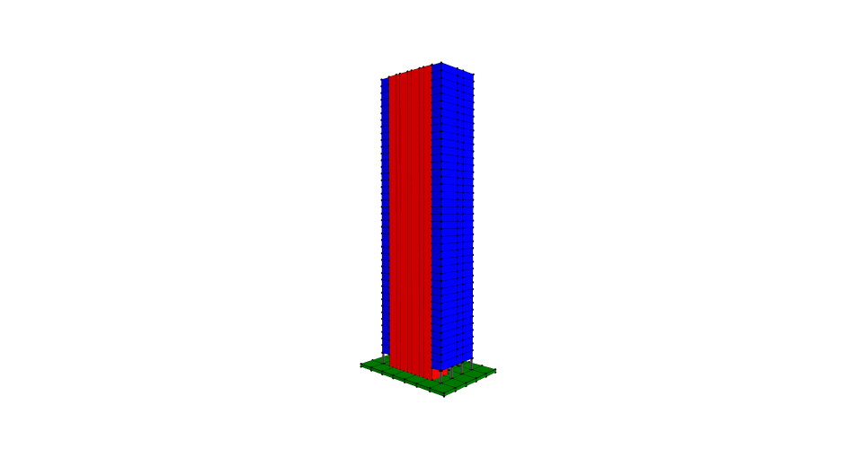
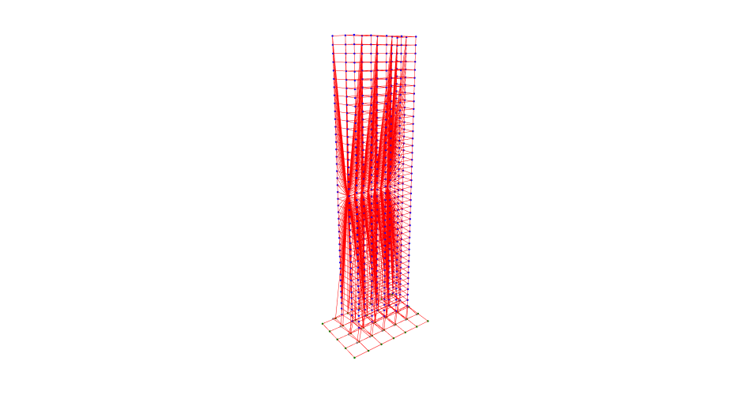
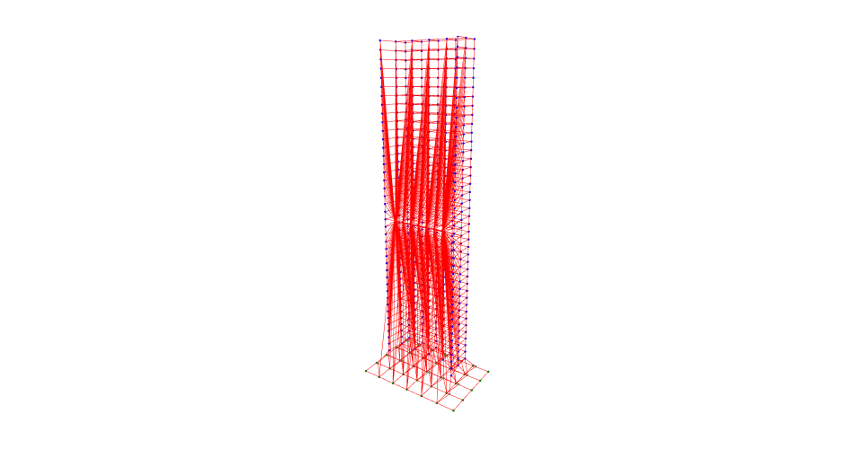
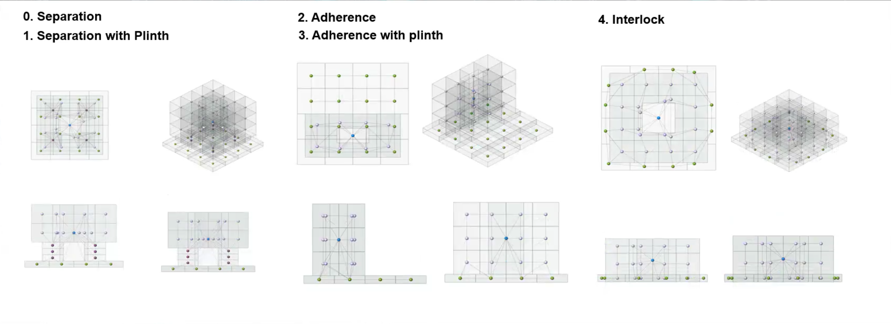

# Assignment 03 — Graph Typology Prediction: Seagram Building

**Giovanni Carlo Volpe** | MACAD 2025–26 | AIA — Graph ML

---

## Objective

The goal of this assignment is to classify the **structural-spatial typology** of the Seagram Building main tower by representing it as a graph and running it through a pre-trained Graph Neural Network (GraphSAGE). The model is trained to recognise five typological categories based on the spatial adjacency relationships between building components:

| Label | Typology |
|---|---|
| 0 | Separation |
| 1 | **Separation with Plinth** |
| 2 | Adherence |
| 3 | Adherence with Plinth |
| 4 | Interlock |

---

## 1. Building Model

The Seagram Building main tower was modelled in Rhino and exported as four separate OBJ files — `ground.obj`, `columns.obj`, `offices.obj`, and `core.obj` — each corresponding to a distinct architectural component layer.

<table>
<tr>
<td></td>
<td></td>
</tr>
<tr>
<td align="center"><i>Wireframe — full tower with plinth</i></td>
<td align="center"><i>Wireframe — core visible through façade</i></td>
</tr>
</table>

---

## 2. Cell Complex & Component Classification

Each OBJ was processed using TopologicPy: faces were flattened, merged via `Topology.SelfMerge`, and individual cells were tagged with a `cell_type` integer, a `cell_name`, and a display colour using a `tag_cells` helper function.

| Component | `cell_type` | Color |
|---|---|---|
| Ground / Plinth | 0 | Green |
| Columns | 1 | Gray |
| Offices | 3 | Blue |
| Core | 4 | Red |

The four tagged cell lists were merged into a single `CellComplex` and dictionaries were transferred via `Topology.TransferDictionariesBySelectors`.

<table>
<tr>
<td></td>
<td></td>
</tr>
<tr>
<td align="center"><i>Cell complex — offices (blue), ground (green), columns (gray)</i></td>
<td align="center"><i>Cell complex — core (red) separated from office floors (blue)</i></td>
</tr>
</table>

---

## 3. Adjacency Graph

`Graph.ByTopology(model)` converts the CellComplex into an adjacency graph where each node represents a spatial cell and each edge represents a shared face between adjacent cells. Nodes were enriched with one-hot encoded `feature_00`–`feature_04` vectors derived from `cell_type`.

<table>
<tr>
<td></td>
<td></td>
</tr>
<tr>
<td align="center"><i>Adjacency graph — view 1</i></td>
<td align="center"><i>Adjacency graph — view 2</i></td>
</tr>
</table>

The graph was exported to CSV (`graphs.csv`, `nodes.csv`, `edges.csv`) and fed into the pre-trained model.

---

## 4. Prediction Result

| | |
|---|---|
| **Model** | GraphSAGE (2 × 128 hidden dims, mean pooling) |
| **Predicted label** | 1 |
| **Predicted typology** | **Separation with Plinth** |

### Interpretation

The classification **Separation with Plinth** describes a tower in which the main volume sits on a podium or base slab that is structurally and spatially distinct from the tower above. In the Seagram Building this is geometrically consistent: the building rises from a broad granite plinth that extends beyond the tower footprint, while the office floors, service core, and structural columns are clearly separated from the ground level both spatially and topologically. The GNN identified this configuration with full confidence from the adjacency structure alone, without any explicit geometric input — demonstrating the power of graph-based representations for architectural typology classification.

*The five graph typology classes used for training and classification, shown in 3D and plan views.*
